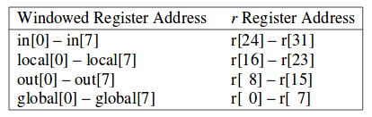
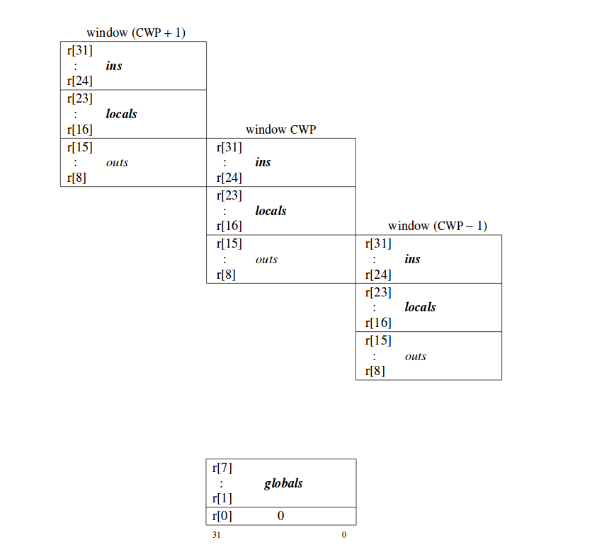

# INSTRUCCIONES (Lenguaje de Computador):
Las palabras de un lenguaje de computador son conocidas como **INSTRUCCIONES** y el vocabulario es conocido como **SET DE INSTRUCCIONES**.

Para entender como es el funcionamiento de este lenguaje de computo vamos a trabajar con:**(Scalable Processor Architecture) SPARCV8**, que es una arquitectura con un conjunto de instrucciones **RISC**; esta arquitectura tiene entre 40 -520 registros.

## Manual de arquitectura SPARC V8:
* Operaciones del hardware del computador
* las operaciones de aritmética básica tienen unas instrucciones especificas que permiten realizarlas. Estas instrucciones tienen un tamaño de **32 bits** y son triádicas.
### Ejemplo:
Supongamos la siguiente operación aritmético lógica
* SUMA B+C=A
* ADD B,C,A
Donde **B** y **C** son operandos y **A** es el resultado.

Pero antes de comprender como vamos a darle la instrucciones a un computador para que resuelva operaciones aritmetico lógicas, debemos entender cuales son **principios de diseño de toda arquitectura de cómputo**

# Principios de diseño de arquitectura.
## Primer principio de diseño de hardware: La simplicidad favorece la regularidad.
* Ejemplo de una asignación en **SPARC V8**
*  H = (A+B) - (C+D)
*  ADD A B T0  
*  ADD C D T1 
* SUB T0 T1 H 

### Registros
Un registro es una memoria de alta velocidad y poca capacidad, integrada en el microprocesador, que permite guardar transitoriamente y acceder a valores muy usados, generalmente en operaciones matemáticas.
## Segundo principio de diseño de hardware: Entre más pequeños más rápido.

 
 
 
 
 
 

