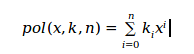

# INSTRUCCIONES (Lenguaje de Computador):
Las palabras de un lenguaje de computador son conocidas como **INSTRUCCIONES** y el vocabulario es conocido como **SET DE INSTRUCCIONES**.

Para entender como es el funcionamiento de este lenguaje de computo vamos a trabajar con:**(Scalable Processor Architecture) SPARCV8**, que es una arquitectura con un conjunto de instrucciones **RISC**; esta arquitectura tiene entre 40 -520 registros.

## Manual de arquitectura SPARC V8:
* Operaciones del hardware del computador
* las operaciones de aritmética básica tienen unas instrucciones especificas que permiten realizarlas. Estas instrucciones tienen un tamaño de **32 bits** y son triádicas.
### Ejemplo:
Supongamos la siguiente operación aritmético lógica
* SUMA B+C=A
* ADD B,C,A
Donde **B** y **C** son operandos y **A** es el resultado.

Pero antes de comprender como vamos a darle la instrucciones a un computador para que resuelva operaciones aritmetico lógicas, debemos entender cuales son **principios de diseño de toda arquitectura de cómputo**

# Principios de diseño de arquitectura.
## Primer principio de diseño de hardware: La simplicidad favorece la regularidad.
* Ejemplo de una asignación en **SPARC V8**
*  H = (A+B) - (C+D)
*  add A, B, T0  
*  add C, D, T1 
*  sub T0, T1, H 

### Registros
Un registro es una memoria de alta velocidad y poca capacidad, integrada en el microprocesador, que permite guardar transitoriamente y acceder a valores muy usados, generalmente en operaciones matemáticas.
## Segundo principio de diseño de hardware: Entre más pequeños más rápido.

 
 Está dividida en:

Registros de Entrada: 8 registros de propósito general. Por estándar se sugiere que sean usados para recibir parámetros.
Registros de Salida: 8 registros de propósito general. Por estándar se sugiere que sean usados para retornar valores.
Registros Locales: 8 registros de propósito general. Por estándar se sugiere que sean usados para definir variables dentro de una función.
Registros Globales: 8 registros de propósito general. Por estándar se sugiere que sean usados para almacenar variables globales
 
 
 
 ### Ejemplo usando la notación SPARC V8
 * H = (A+B) - (C+D)
 * T0 = %L5
 * T0 = %L6
 * %L0 = (%L1 + %L2)-(%L3+%L4)
 
 #### Al definir los registros que se van a usar para representar los valores de las variables, se pasa entonces a usar las instrucciones de la arquitectura SPARC V8.
 * add %L1, %L2, %L5
 * add %L3, %L4, %L6
 * sub %L5, %L6, %L0
 
 # TALLER
 * Representar los numeros del 0-31, en binarios de 5bits
 * Asignar los registros a la siguiente operación: 
 + + H = (S-J) + (T-X)-(V+W)
 * Implemente la función **pot** en lenguaje de alto nivel,que realice la potencia de dos números enteros sin signo realizando llamados a la mult.
 * Calcule un **polinomio de grado n** en lenguaje de alto nivel, en donde los coeficientes del polinomio se encuentran almacenados en un vector k de n+1 posiciones, de la siguientes forma:
 
  + + 
  
 * Implemente una función **fact** en lenguaje de alto nivel, que calcule el **factorial** de un número entero sin signo

 

 
 
 
 

