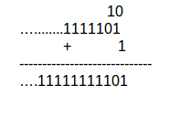
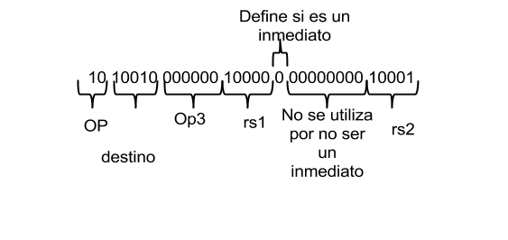
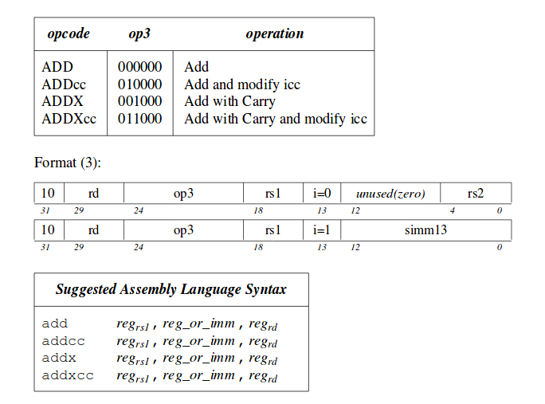
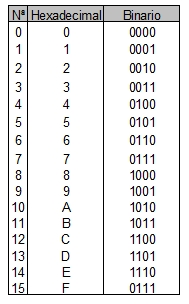

# Principios de diseño de arquitectura
## Segundo principio de diseño de hardware: Entre más pequeños más rápido.
### Operandos de memoria.

Cuando el procesador necesita utilizar la información que se encuentra en una estructura compleja de datos se hace necesesario el llamado a memoria. Para realizar este tipo de accesos necesitamos utilizar instrucciones conocidas como instrucciones de tranferencias de datos.

En nuestra arquitectura **SPARC V8** tenemos las instrucciones **ld** (LOAD) y **st** (STORE), cada una tiene la capacidad de manejar datos de **32 bits**.

la manera en como se usa las instrucciones de memoria de la arquitectura **SPARC V8** es de la siguiente manera:

- ld[**address**],regrd
- st regrd, [**address**]

Un **address** puede ser (**r[rs1] + r[rs2]**) ó (**r[rs1]+imm**)

La arquitectura de **SPARC V8** maneja un direccionamiento por **byte**, de esta manera cada posición de memoria almacena **32 bits** o **4 bytes**.

### Ejemplo.

- A = B + C[9]
Lo primero que debemos hacer es asignarle los registros a las variables, en este caso a **A, B, C**.
Una vez le halla asigando los registros:**A = %l0**,  **B = %l1**, **C = %l2**. Debo usar una intrucción de tranferencia que me carge el dato que esta contenido en C[9]; para ello usa la instrucción **LOAD**.
- ld[%l2+(9*4)],%l3
- add %l1,%l3,%l0
## Tercer principio de diseño de hardware: Hacer el caso común más rápido.

### Operandos contantes o inmediatos.
Generalmente son los valores que se le asignan a una variable cuando la inicializamos o cuando se usan ciclos.

- r[rs1], imm, r[rd]
#### Ejemplo
- A = 5
- add %l0,5,%l2
### Números con signo y sin signo.
##### Signo con magnitud:
No tuvo mucha aplicación en el hardware debido a la notación, pues era más dificil de implementar.

##### Complemento a 2:

- +2 ----> 00000000000000000000000000000010
- -2 ----> niego el número positivo y a esa negación le sumo 1.

### Representando instrucciones en el computador
#### Ejemplo
- add %l0, %l1,%l3 ---> r[16]-r[23], recuerda que son los registros locales que van desde %l0-%l7

### Formato instrucciones ADD.

Cuando pasamos nuestras instrucciones de forma binaria de 32 bits, puede ser un poco dispensioso a la hora de leer los formatos, por lo tanto por comodidad se suele representar las instrucciones binarias en hexadecimal.

Por lo tanto, para indicar, el número binario de la instrucción de la suma de 32 bits, se utilizo la nomenclatura hexadecimal:
-0xA4040011 ----> add (**0x** indica que se trata de un número hexadecimal.) 

## TALLER

1. Convertir a instrucciones **SPARC V8**.
- int x = 0; 
- int y = 8; 
- int z = 1; 
2. Convertir a instrucciones **SPARC V8**, a binario de **32 bits** usando el **formato 3** y a número **hexadecimal**.
- y = x + 3;
- z = z + 3;
- x = (x - z) + (3 + y);

3. Usar el ld, y st.
- a[4] = a[2] + x;
- y[0] = y[40] + 13;

