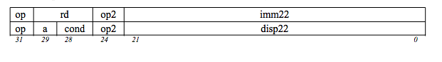
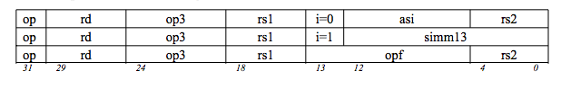
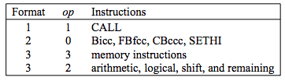
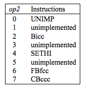
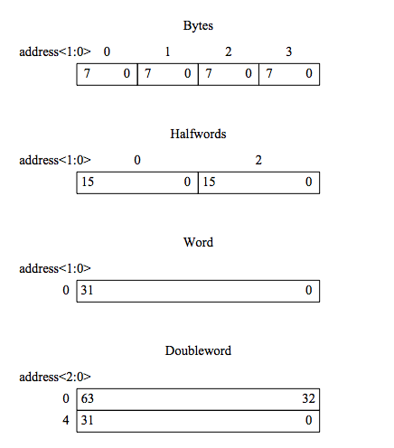
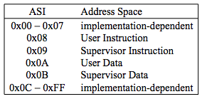

# Principios de diseño de arquitectura
## Cuarto principio de diseño de hardware
### Intrucciones
#### - Formato 1 (**OP = 1**): CALL

#### - Formato 2 (**OP = 0**): **SETHI** e instrucciones de salto (**branch**)(**Bicc, FBFee, CPccc**)

#### - Formaro 3: Intrucciones restantes (Aritmético lógicas, de memorias): (**OP = 2 Ó 3**)

### Campos de las instrucciones:
- **OP** y **OP2**: estos dos campos de 2 y 3 bits respectivamente codifican todas las instrucciones y las instrucciones de formato 2.

#### Codificación **OP**

#### Codificación **OP2**

### Campos de los formatos
+ **rd** : Es el registro fuente o el registro destino para una instrucciones **load/store** ó alguna operación aritmético-lógica.
+ **a** : Es un bit de anulación que evita que un salto sea tomado.
+ **cond** : Codifican la condición que se evalúa para determinar si un salto se hace o no.
+ **imm22** : Son los 22 bits que usa la instrucción **SETHI** para llevarlos a los 22 bits más significativos de un registro destino.
+ **disp22 y disp30** : Valores de desplazamiento relativo dentro de la memoria de instrucciones utilizados por **BRANCH** y por las instrucción **CALL**.
+ **op3** : Es un campo de 6 bits que ayuda a codificar todas las instrucciones de formato 3.
+ **i** : Es un bit que ayuda a determinar si el segundo operando de una instrucción arimética-lógica, es un valor inmediato o el contenido de un registro.
+ **asi** : Estos 8 bits ayudan a codificar un identificador de espacio de direccionamiento (Address Space Identifier)
+ **rs1** : El primer opernando de una instruccion aritmético-lógica, Load/Store, o de corrimiento.
+ **rs2** : Segundo operando de una instruccion si i = 1.
+ **imm13** : Segundo operando de una instruccion si i = 0.
+ **opf** : Codificación de operaciones de punto flotante.

### Categorías de las Intrucciones
Las instrucciones SPARC V8 se pueden agrupar en seis categorías: load/store (carga / almacenamiento), aritmética-lógicas,
Transferencia de control (CTI), registro de control de estado, operación de punto flotante,
Y coprocesador operan:  

+ Load/Store (carga / almacenamiento)
+ Aritmético-lógicas
+ CTI(Control Transfer Instruction - Instrucciones de tranferencia de control)
+ Acceso a registros de estado
+ Instrucciones de unidad de punto flotante
+ Intrucciones de co-procesador

### Load/Store:

Son las únicas instrucciones que acceden a memoria, Instrucciones de load y store
tiene 2 registros **RS1** ,**RS2** o un registro ** RS1** y **simm13** para calcular la dirección de memoria de 32 bits.
+ 1 Byte ---> 8 bits
+ 2 Bytes ---> 16 bits (HalfWord)
+ 4 Bytes ---> 32 bits (Word)
+ 8 Bytes ---> 64 bits (DoubleWord)
De esta manera identificamos el espacio de direccionamiento.

#### identificador de espacio de Memoria

### Instrucciones aritméticas enteras.

+ Son instrucciones triadicas.
+ Cualquier lectura del r[0] ---> (%g0) da cero(0).
+ Cualquier escritura en el registro r[0] ---> (%g0) es descartada.

## TALLER
