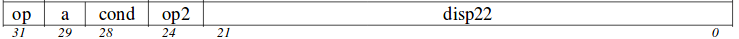
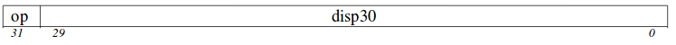
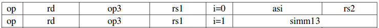
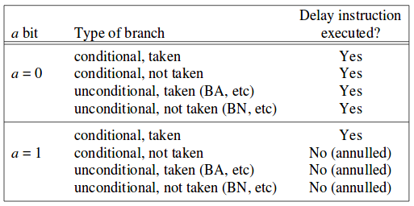

# Categorías de las Intrucciones
Las instrucciones SPARC V8 se pueden agrupar en seis categorías:  

+ Load/Store (carga / almacenamiento)
+ Aritmético-lógicas
+ **CTI(Control Transfer Instruction - Instrucciones de control de tranferencia )**
+ Acceso a registros de estado
+ Instrucciones de unidad de punto flotante
+ Intrucciones de co-procesador

## Instrucciones de control de transferencia (CTI).
 Las instrucciones de control de tranferencia se conforman por instrucciones que modifican el **nPC**. (Next program Counter)**nPC** es un registro de 32 bits que contiene las dirección de la próxima instrucción a ejectutar. Las instrucciones de control de tranferencia son: 
 
 - Ramas condicionados **Branch** (**Bicc, FBfcc,CPccc**)
 - Llamados **Call and Link** (**CALL**)
 - Saltos **Jump and Link**(**JMPL**)
 - Retorno de excepciones **Return from Trap**(**RETT**)
 - Excepciones **Trap** (**TIcc**)
 
Las instrucciones de control de transferencia puedes ser categorizadas, acorde como se muestran en la tabla, además la dirección destino es calculada teniendo en cuenta (PC-relativo vs. register-indirect) y el tiempo relativo que toma la trasnferencia con respecto al (non delay,vs. delay vs. condicional-delay).
 
 ##### Categorias instrucciones de control de transferencia:
 
 
 
 
 ### Branch
 #### Formato 2 ---> OP = 00 ---> 0.
  
 
 
 ### CALL
 #### Formato 1 ---> OP = 01 ---> 1.
  
  
 ### JMPL
 #### Formato 3 ---> OP = 10 ---> 2.
  

 - **PC-relativo**: Calcula su direccion por medio de la extensioón de signo del campo inmediato a 32 bits.
 - **register-indirect**: Calcula su dirección destino de la siguiente manera "**r[rs1]+r[rs2]**" si **i**= 0, ó **r[rs1]+ sign_ext(simm13)**, si **i**= 0.  
 - **delayed**: Es la instrucción que es ejecutada despues de realizar un salto, las instrucciones que siempre realizan un delay antes de saltar es **CALL and JMPL**.
 - **non-delay**: salta directamente a la dirección establecida por la instrucción y no toma la instrucción antes de saltar.
 - **Condicional delayed**: Esta delay se toma o no se toma teniendo en cuenta el campo **a** si este es igual a 0, se ejectuta el Delay slot, si esta en 1 no se tiene en cuenta el delay.
 
  
  
  # TALLER
  
  ¿Que son los registros de estado?
  
  
  
 
 
 
 
 

