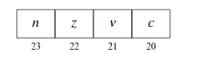
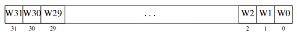
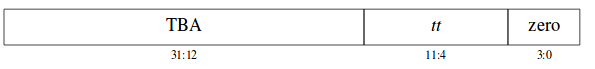

Capitulo 4---> Manual arquictectura sparc v8.

# Registros
El procesador SPARC V8 incluye varios ripos de registros: los de proposito general o registros de datos y resgistro de control y estado. 
- IU(unidad de tipo entero)
- FPU(Unidad de punto flotante)
- CP 
## Registro de estados.
Permiten modificar el comportamiento en un momento determinado.

### Registros de propósito general.
- r(register file soporta entre 40-520 registros)
- f(FPU:Floating Point Unit)
- Co-Procesador

### Registro de control y estado.
#### **PSR**(Processor State Register)

- **impl**: Implementación
- **version**: Vérsión
- **ICC** : Esta dividido en 4 bits: **n**: Negativo cuando una operación da un número negativo, **Z**: se coloca en 1, cuando el resultado de la operación da cero, **v**: Over Flow se activa cuando el resultado de una operación da más de 32 bits y el bit **c**: Carry, se activa cuando se tiene acarreo.

- **reserved**: son un conjunto de bit no definidos dentro de la especificación de la arquitectura para que el diseñador los use de manera libre.
- **EC**(Enable co-processor): Indica si el procesador tiene unidad de co-procesamiento(FPGA,Targeta gráfica, etc)
- **EF**: Es un bit que me indica si la arquitectura tiene unidad de punto flotante.
- **PIL**: Processor Interrupt level(la arquitectura SPARC V8 tiene iterrupciones llamadas Traps)
- **S**: Supervisor; Indica el modo en el cual se ejecutó el procesador durante la instruccion anterior.
- **ET**: Habilita al procesador para que soporte traps.
- **CWP** Current Windows Pointer, Indica sobre que ventana estoy accediendo o guardando los datos.

#### Window Invalid Mask

- **Campo WIM**

Las ventanas implementadas tiene el bit en cero, si no estan implementadas tiene un valor de 1.

#### TBR(Traps base register)
- ** Campos de TBR

- **TBA**: Traps Base Address. Envía rutnias especificas para tratar un trap determinado.
- **traps Type**: Indica que tipo de traps se genero.
- **zero**: Bits en cero
#### Y(Registros de Múltiplicación y División)

Se usa como registro para hacer operaciónes entre enteros. Podemos multiplicar dos enteros de 32 bits y obtener un resultado de 64. Tambien puede existir que se de una división de  bits entre 32 bits. 

#### Program Counters(nPC, PC)
- **nPC**: (Next Program Counter), Es un registro de 32 bits que contiene la dirección próxima de una instrucción a ejecutar osea **PC+4**.
- **PC**: (Program Counter): Es un registro de 32 bits contiene la dirección de la instrucción actual.

