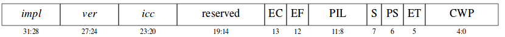

Capitulo 4---> Manual arquictectura sparc v8.

# Registros
El procesador SPARC V8 incluye varios ripos de registros: los de proposito general o registros de datos y resgistro de control y estado. 
- IU(unidad de tipo entero)
- FPU(Unidad de punto flotante)
- CP 
## Registro de estados.
Permiten modificar el comportamiento en un momento determinado.

### Registros de propósito general.
- r(register file soporta entre 40-520 registros)
- f(FPU:Floating Point Unit)
- Co-Procesador

### Registro de control y estado.
- **PSR**(Processor State Register)

