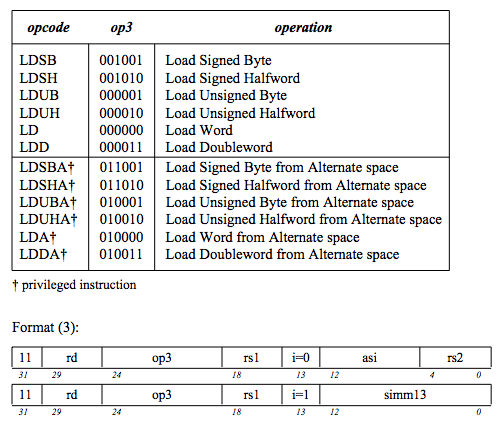
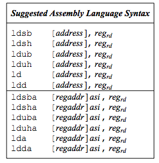
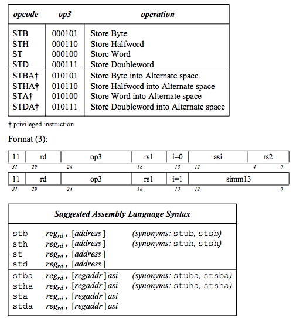
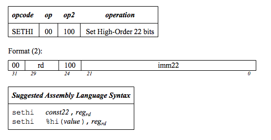
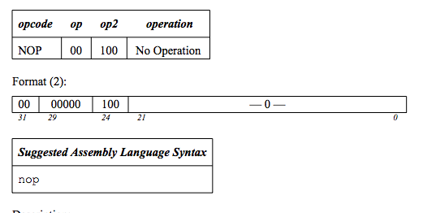
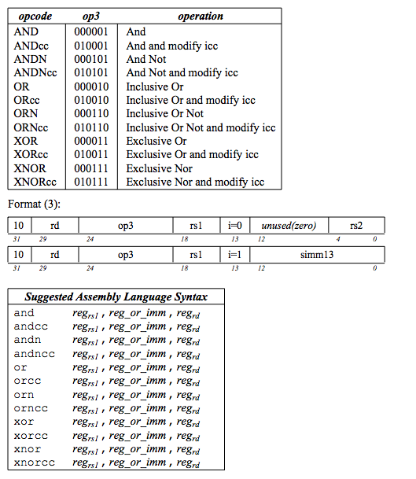

#### Apendice B. Manual Arquitectura SPARC v8.
# Descripción de las instrucciones de la arquitectura SPARC V8
### Instrucción entera LOAD

### Instrucción entera STORE

### Instrucción SETHI

### Instruccion NOP

### Instrucciones Lógicas

### Instrucciones SHIFT
### Instrucciones SAVE and RESTORE
### TALLER
¿ Que son las instrucciones sintéticas ?

